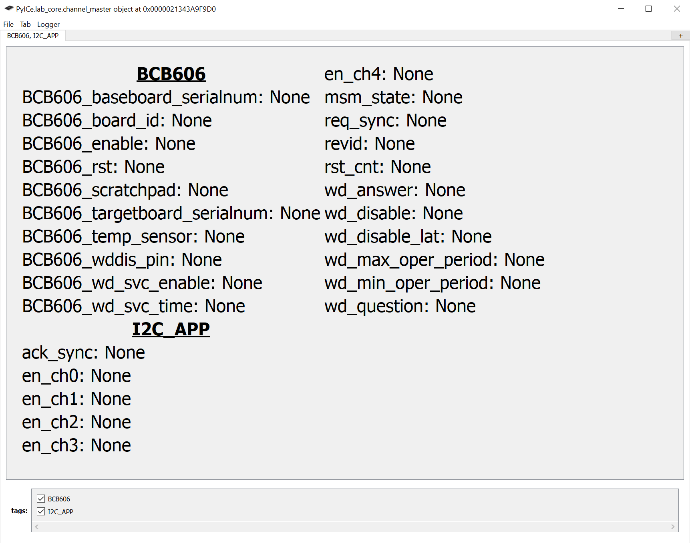

# INTRODUCTION

The MPBB demonstration board provides a hardware platform and firmware for interacting with the 5-channel automotive PMIC Morpheus in a way that is substantially similar, and largely compatible, with ADI's internal bench evaluation system. It is a baseboard, or motherboard, that receives a target board for the Morpheus PMIC IC (aka LT3390 / LT3390-3 / LT3390-5 /...). A target board for each supported variant of Morpheus is available from ADI. For custom applications of Morpheus, please contact your ADI sales or applications representative.

The MPBB also provides the services needed to interact with other target-board resources such as a precision temperature sensor and an EEPROM for electronically identifying the target-board.

The demo-board incorporates a ATSAMD21 microcontroller programmed to emulate an Arduino M0 (Native USB) so that firmware experimentation can be performed with as little setup burden as possible. It also includes an LTM2884 USB isolator module so that board faults, such as power supply reversal, don't damage the host computer.

The MPBB is designed to interface with a host computer via the Labcomm protocol. Labcomm is a lightweight binary frame packet protocol that can be transmitted over USB. A Labcomm parser and a Code-Free GUI are available from PyICe on GitHub. PyICe is Analog Device's Python Integrated Circuit Environment, a Python library for holistically interacting with integrated circuits and laboratory test equipment. Contact your Analog Devices applications engineer for assistance in installing PyICe on your computer. Below is an image of the PyICe Code-Free GUI running on the MPBB:

*Figure 1. The PyICe Code-Free GUI*

The MPBB firmware stack consists of the following modules, each of which will be described below.

### Source Files
- MPBB.ino
- MPBB.h
- board.h
- idstring.h
- labcomm.cpp / labcomm.h
- postoffice.cpp / postoffice.h
- heartbeat.cpp / heartbeat.h
- enable_pin.cpp / enable_pin.h
- identify.cpp / identify.h
- pgood_pin.cpp / pgood_pin.h
- faultb_pin.cpp / faultb_pin.h
- mcuerr_pin.cpp / mcuerr_pin.h
- wddis_pin.cpp / wddis_pin.h
- remote_ath.cpp / remote_ath.h
- watchdog.cpp / watchdog.h
- eeprom.cpp / eeprom.h
- smbus.cpp / smbus.h
- smbus_comnd_struct.h
- smbus_services.cpp / smbus_services.h
- softport.cpp / softport.h
- temp_sensor.cpp / temp_sensor.h
- pec.cpp / pec.h
- set_leds.cpp / set_leds.h
- pushbutton.cpp / pushbutton.h
- SERCOM.cpp / SERCOM.h

## Dependencies

The Arduino project has the following dependencies:
- FlashStorage_SAMD
- SoftWire

## MPBB.ino

This main program file contains the hardware setup routine and main program loop. The setup routine initializes the Wire (I2C) interface, USB serial at 115200 baud, configures all GPIO pins, and sets safe default states (ENABLE off, WDDIS asserted, MCUERR deasserted, REMOTE_ATH low). The main program consists of a simple round-robin operating system that calls on the available services repeatedly with no specific priority. Each service will generally only perform a function if there is a Labcomm message requesting it do so but will more likely do nothing and drop straight through. One exception to this is the watchdog service routine which will service Morpheus's question-answer watchdog if enabled to do so via a Labcomm command from the USB port.

## MPBB.h

Master include file that pulls in all module headers. Including this single file provides access to the entire firmware stack.

## board.h

Pin and peripheral definitions for the MPBB hardware. Defines all GPIO pin assignments:

- **Inputs:** PUSHBUTTON_PIN (23), PGOOD_PIN (17), FAULTB_PIN (18)
- **Outputs:** PGOOD_LED (19, green), FAULTB_LED (31, red), HEARTBEAT_LED (25, orange), ENABLEB_PIN (8), MCUERRB_PIN (5), WDDISB_PIN (2), TESTHOOK_PIN (41), REMOTE_ATH_PIN (38)
- **Auxiliary I2C:** AUX_SDA (6), AUX_SCL (7)

## idstring.h

Defines the firmware identification string ("MPBB Morpheus Demo Board REV: 0.0") stored in PROGMEM, the scratchpad size (255 bytes), and computed payload sizes for the identify module.

## labcomm.cpp / labcomm.h

Defines and implements the Labcomm serial protocol. The protocol uses a 10-byte preamble ("L@BC0MmADI") and 4-byte endamble ("TeoM") to frame packets. Each packet contains a version byte, 2-byte destination ID, 2-byte source ID, 4-byte payload size, and up to 4096 bytes of payload. The header defines the Mailbox template class with get_packet() (receive) and send_packet() (transmit) methods. The implementation provides a state-machine parser that processes incoming serial bytes and dispatches complete packets.

## postoffice.cpp / postoffice.h

The post office creates Mailbox objects and executes simple send and receive methods. Each of the mailboxes consist of a data structure and methods for receiving and dispatching messages via Labcomm. The post office is custom to the MPBB because the endpoints, or message recipients, are custom. The post office was designed to be as easily comprehensible and extensible as possible for re-use on other Labcomm projects. The Mailbox class is defined in labcomm.h.

The header defines all mailbox addresses (IDs 1-12):

| ID  | Endpoint       |
| --- | -------------- |
| 1   | PyICe_GUI      |
| 2   | ENABLE_PIN     |
| 3   | PGOOD_PIN      |
| 4   | WD_DIS_PIN     |
| 5   | SMBUS_SERVICES |
| 6   | IDENTIFY       |
| 7   | WATCHDOG       |
| 8   | EEPROM         |
| 9   | TMP117         |
| 10  | FAULTB_PIN     |
| 11  | MCUERR_PIN     |
| 12  | REM_ATH_PIN    |

The implementation instantiates all 12 Mailbox objects and provides process_mail(), which routes incoming Labcomm packets to the correct mailbox by destination ID and checks each mailbox's outbox for outgoing packets to send.

## heartbeat.cpp

The heartbeat routine reads the Arduino's millisecond clock and drives the HEARTBEAT_LED (orange) in a characteristic double-blink pattern using a bitmask on the millisecond counter. If the micro-controller is unburdened, the heartbeat will look quite regular. Conversely, if there is a high burden to send or receive voluminous SMBus data, the heartbeat will not be serviced regularly and an irregular beating pattern will appear.

## enable_pin.cpp

The enable pin endpoint controls two physical pins: ENABLEB_PIN (active low) and TESTHOOK_PIN. Together they produce three states: OFF (TH=LOW, ~EN=HIGH), ON (TH=LOW, ~EN=LOW), and HOOK (TH=HIGH, ~EN=LOW). When OFF, the Morpheus PMIC is disabled and SMBus communication should not be expected. When ON, Morpheus will be active, communicating, and providing output voltages. When transitioned from OFF to HOOK, Morpheus will enter its service mode. Service mode requires the use of a 12V, center positive, wall adapter with a 5.5mm barrel jack (supplied with the MPBB) at connector J1 and should only be used with advice and consent of factory trained Analog Devices applications or design engineers.

The enable pin module has a simple Labcomm payload command structure consisting of 2-bytes in and 1-byte out.

The Enable pin's packet payload 2-byte structure is:

| COMMAND (1 Byte) | DATA (1 Byte) |
| ---------------- | ------------- |

*Table 1. Enable Pin Module Command Structure*

The ENABLE pin's command values are as follows:

| SET_STATE | 1   |
| --------- | --- |
| GET_STATE | 2   |

*Table 2. Enable Pin Module Commands*

The SET_STATE data values are:

| OFF  | 0   |
| ---- | --- |
| ON   | 1   |
| HOOK | 2   |

*Table 3. Enable Pin Settings*

When the GET_STATE command is deployed, a single byte is returned encoding the combined state as digitalRead(TESTHOOK_PIN) + !digitalRead(ENABLEB_PIN), yielding 0 for OFF, 1 for ON, and 2 for HOOK.

## identify.cpp

This module returns identifying information about the firmware version currently running on the MPBB. It has a simple one-byte command structure. To retrieve the board's version information, the payload should contain the ASCII value for the simple question mark "?".

The identify module also has the ability to set and retrieve a 255 byte nonvolatile scratchpad value (stored in SAMD flash via FlashStorage_SAMD) that can be used to leave notes or declare ownership, for instance. There is also a unique serial number for each instance of the MPBB. The serial number is retrieved from the 128-bit (16 byte) memory location that is factory programmed in the SAMD21 microcontroller. Additionally, a MAX_QUIET command (code 4) puts the microcontroller into deep sleep by disabling all oscillator RUNSTDBY bits and executing a WFI instruction. This is an unrecoverable shutdown intended for low-noise measurement scenarios.

The table below shows the expected command and data fields for each command:

| Command           | Code             | Data                                                                       |
| ----------------- | ---------------- | -------------------------------------------------------------------------- |
| Identify          | "?" (63 or 0x3F) | Returns ID String (of Labcomm payload size)                                |
| Write Scratchpad  | 1                | Send up to 255 Bytes (Chars)                                               |
| Read Scratchpad   | 2                | Expect back up to 255 Bytes (Chars)                                        |
| Get Serial Number | 3                | Reads back the Arduino M0's (SAMD21) unique 128 bit (16 bytes) internal ID |
| Max Quiet         | 4                | Enters deep sleep (unrecoverable low-noise shutdown)                       |

*Table 4. Identify Module Commands*

## pgood_pin.cpp

The PGOOD pin module expects no incoming payload (payload size=0) and responds with a single byte written in response. Merely addressing the PGOOD module with no payload is sufficient to trigger the module to return Morpheus's PGOOD pin value to the host. The one-byte response will be 1 if PGOOD is high and 0 if it is low.

## faultb_pin.cpp

The FAULTB pin module expects no incoming payload (payload size=0) and responds with a single byte written in response. Merely addressing the FAULTB module with no payload is sufficient to trigger the module to return Morpheus's FAULTB pin value to the host. The one-byte response will be 1 if FAULTB is high and 0 if it is low.

## mcuerr_pin.cpp

The MCUERR pin module can set or get the state of the MCUERRB output pin. It has a 2-byte command structure with SET_STATE (1) and GET_STATE (2) commands. SET_STATE accepts OFF (0) or ON (1) as data values. GET_STATE returns a single byte with the current pin state.

## wddis_pin.cpp

Morpheus has a WD_DISABLE pin for either eliminating the watchdog feature or for temporarily disabling it for product debug and development. The WD_DISABLE pin has a 2-byte command structure.

Note: The WDDISB_PIN is hardware-inverted on the PCB by way of an extra transistor (so the pull-up can be AVIN). The firmware compensates for this inversion: ON drives the pin LOW, OFF drives it HIGH, and GET_STATE returns the inverted digitalRead value.

The WD_DISABLE pin's packet payload 2-byte structure is:

| COMMAND (1 Byte) | DATA (1 Byte) |
| ---------------- | ------------- |

*Table 5. WD_DISABLE Pin Module Command Structure*

The WD_DISABLE pin's command values are as follows:

| SET_STATE | 1   |
| --------- | --- |
| GET_STATE | 2   |

*Table 6. WD_DISABLE Module Commands*

The SET_STATE data values are:

| OFF | 0   |
| --- | --- |
| ON  | 1   |

*Table 7. WD_DISABLE Pin Settings*

When the GET_STATE command is deployed, a single byte with the current logical (not physical) state of the WD_DISABLE pin is returned.

## remote_ath.cpp

The Remote ATH (Alert Threshold) pin module controls REMOTE_ATH_PIN for ATH control when using a MAX20403 interposer board. It has a 2-byte command structure with SET_STATE (1) and GET_STATE (2) commands. SET_STATE accepts OFF (0) or ON (1) as data values. GET_STATE returns a single byte with the current pin state.

## watchdog.cpp

The watchdog routine shows an example of how to service Morpheus's watchdog function. It periodically checks the system's micro-second clock and decides if the watchdog should be serviced. The watchdog will only be serviced when PGOOD is high.

The LT3390 Morpheus variant has a minimum open window time of 16ms and a maximum open window time of 144ms. The default MPBB response time has been pre-programmed at 48ms (48000us) to land geometrically between the open and closed window values. The default 7-bit address is 0x69, question address is 0x17, answer address is 0x18, and CRC polynomial is 0x07 with PEC enabled. These values can be adjusted remotely as shown in Table 8.

The payload for the watchdog module expects one to five bytes in and returns 4-bytes out.

The Watchdog Module command structure is as follows:

| Command              | Code | Data          |       |       |         |
| -------------------- | ---- | ------------- | ----- | ----- | ------- |
| SET_SERVICE_STATE    | 0    | 0/1           | --    | --    | --      |
| GET_SERVICE_STATE    | 1    | --            | --    | --    | --      |
| SET_RESPONSE_TIME_us | 2    | MS-Byte       | Byte3 | Byte2 | LS-Byte |
| GET_RESPONSE_TIME_us | 3    | --            | --    | --    | --      |
| SET_ADDR7            | 4    | Addr7         | --    | --    | --      |
| GET_ADDR7            | 5    | --            | --    | --    | --      |
| SET_SERVICE_METHOD   | 6    | 0/1           | --    | --    | --      |
| GET_SERVICE_METHOD   | 7    | --            | --    | --    | --      |
| SET_USE_PEC          | 8    | 0/1           | --    | --    | --      |
| GET_USE_PEC          | 9    | --            | --    | --    | --      |
| SET_QUESTION_ADDR    | 10   | QUESTION ADDR | --    | --    | --      |
| GET_QUESTION_ADDR    | 11   | --            | --    | --    | --      |
| SET_ANSWER_ADDR      | 12   | ANS_ADDR      | --    | --    | --      |
| GET_ANSWER_ADDR      | 13   | --            | --    | --    | --      |
| SET_CRC_POLY         | 14   | POLY          | --    | --    | --      |
| GET_CRC_POLY         | 15   | --            | --    | --    | --      |

*Table 8. Watchdog Module Command Structure and Settings*

The response time is a 4-byte (32-bit integer) value representing the number of micro-seconds from one successful service of a watchdog to the next. Depending on loading from the other services on the demo-board, and the operating system, the service time will not be exactly this value. It will always be longer but will never be shorter.

The return value from the GET_RESPONSE_TIME_us query is a similar 4-byte (32 bit) integer representing the micro-seconds dwell to which the watchdog routine is currently set. The 4-byte, 32 bit, number is consistent with the Arduino's micros() function from the Arduino.h library.

Two methods of generating watchdog replies are demonstrated with this firmware stack, lookup table and algorithmic. The lookup table, which can be stored in abundant program memory (PROGMEM), is faster but uses a bit of program space. The algorithmic method uses little memory but takes a bit more execution time. Note that changing the method from the user interface will give no outward appearance of a change. The option is only provided as a code example for customers to duplicate.

The GET_SERVICE_METHOD values are:

| USE_LOOKUP_TABLE | 0   |
| ---------------- | --- |
| USE_ALGORITHMIC  | 1   |

There are also options to alter the question address, answer address, CRC polynomial, use of PEC, etc.

## eeprom.cpp

Because Morpheus has many variants, each target board comes electronically marked with an EEPROM (BR24H64FVM-5AC) for identification. Target boards may also be customized by ADI applications engineers for your application. A serial number in the EEPROM helps ADI track and debug your target board and application more readily. There is a target board registry at Analog Devices. If you have questions about how your target board is configured, please contact your ADI applications or design engineer for assistance with your specific application and target board.

The EEPROM is accessed via the auxiliary software I2C port (softport). It handles SMBUS_WRITE_REGISTER and SMBUS_RECEIVE_BYTE transaction types.

## smbus_services.cpp

This is the module that interacts with the Morpheus SMBus (I2C) port and, as such, it offers additional services. It maintains a static register list (up to 256 command codes) and a stream mode flag. Specifically, it has the 5-byte payload command structure shown below followed by a data-list.

| COMMAND | ADDR7 | COMMAND CODE | USE PEC | DATASIZE (8/16) | REG1 | REG2 | REG3 | ... |
| ------- | ----- | ------------ | ------- | --------------- | ---- | ---- | ---- | --- |

*Table 9. SMBus Module Command Structure*

Where the transaction type or command table is:

| Command                    | Code | Bytes Sent (Byte/Word) | Bytes Returned (Byte/Word) |
| -------------------------- | ---- | ---------------------- | -------------------------- |
| SMBUS_QUICK_COMAND         | 1    | 0                      | 0                          |
| SMBUS_SEND_BYTE            | 2    | 1                      | 0                          |
| SMBUS_RECEIVE_BYTE         | 3    | 0                      | 1                          |
| SMBUS_WRITE_REGISTER       | 4    | 1/2                    | 0                          |
| SMBUS_READ_REGISTER        | 5    | 0                      | 1/2                        |
| SMBUS_PROCESS_CALL         | 6    | X                      | 0                          |
| SMBUS_BLOCK_WRITE          | 7    | X                      | Unimplemented              |
| SMBUS_BLOCK_READ           | 8    | X                      | Unimplemented              |
| SET_REGISTER_LIST          | 21   | #bytes/2x#words        | 256/512                    |
| READ_REGISTER_LIST         | 22   | #bytes/2x#words        | 256/512                    |
| ENABLE_STREAM_MODE         | 23   | X                      | 0                          |
| DISABLE_STREAM_MODE        | 24   | X                      | 0                          |
| WRITE_REGISTER_LIST        | 25   | #bytes/2x#words        | 512 ([REG,VAL] Pairs)      |
| SET_REG_LIST_AND_READ_LIST | 26   | 8                      | 256                        |
| SET_REG_LIST_AND_STREAM    | 27   | 8                      | 256                        |

*Table 10. SMBus Module Commands and Expectant Data Sizes*

Every SMBus transaction returns a status byte to the SMBus post office box with which it is communicating. A return value of 0 indicates that the firmware was satisfied with the transaction whereas a nonzero value implies an issue. Please see the binarily weighted 1-Hot table below.

| Return Code | Status                |
| ----------- | --------------------- |
| 0           | SMBUS_SUCCESS         |
| 1           | SMBUS_NACK_ON_ADDRESS |
| 2           | SMBUS_NACK_ON_DATA    |
| 4           | SMBUS_PEC_VALUE_ERROR |
| 8           | SMBUS_SMBUS_TIMEOUT   |
| 16          | SMBUS_BUFFER_OVERFLOW |
| 32          | SMBUS_UNKNOWN_ERROR   |

*Table 11. SMBus Module Return Values*

For list-read modes, the return data is structured as either:

| STATUS | BYTE | STATUS | BYTE | ... |
| ------ | ---- | ------ | ---- | --- |

For Bytes

Or

| STATUS | BYTE-LO | BYTE-HI | STATUS | BYTE-LO | BYTE-HI | ... |
| ------ | ------- | ------- | ------ | ------- | ------- | --- |

For Words

Each grouping of STATUS-DATA-[DATAH] corresponding to the ordered command code list requested for the list read.

## smbus_comnd_struct.h

Defines the SMBus command payload byte layout (TRANSACTION_TYPE, ADDR7, COMMAND_CODE, USE_PEC, DATA_SIZE, START_OF_SMBUS_DATA_IN) and the transaction type enumerations used by smbus_services.cpp.

## temp_sensor.cpp

The Morpheus target board uses a TMP117 temperature sensor to monitor the ambient temperature. This can be useful for laboratory evaluation when using an environmental temperature chamber. Be aware that the MPBB, itself, may not be suitable for use over a wide operating temperature range. The Morpheus development team has a different motherboard intended specifically for use in a wide-range temperature chamber. To get Morpheus characterization data over temperature, please contact your local ADI sales office or applications engineer.

The TMP117 is accessed via the auxiliary software I2C port (softport). Note that the TMP117 does not use standard SMBus byte ordering; byte swapping is handled in the PyICe driver.

## smbus.cpp

This module accesses the built-in two-wire (Wire library) hardware of the ATSAMD21 microcontroller and is used for communicating with the Morpheus PMIC. It provides read_register() and write_register() functions that handle PEC computation and validation when requested. Wire library endTransmission return codes are mapped to the one-hot status codes defined in smbus.h.

## softport.cpp

This module forms a two-wire master out of two standard GPIO pins (AUX_SDA pin 6, AUX_SCL pin 7) on the microcontroller using the SoftWire library, providing a slower but independent secondary I2C port. It is used to communicate with the EEPROM and TMP117 temperature sensor on the target board. It provides write_register (byte/word), read_register (byte/word), and receive_byte operations.

## pec.cpp

Contains routines that compute and validate SMBus Packet Error Checking (PEC) values using CRC-8 (polynomial x^8+x^2+x+1). Provides both a 256-entry lookup table method and a bitwise algorithmic fallback, selectable at compile time via the CRC_TABLE macro.

## set_leds.cpp

Mirrors DUT status onto indicator LEDs each loop iteration. The PGOOD_LED (green, pin 19) follows the PGOOD_PIN input state, and the FAULTB_LED (red, pin 31) follows the inverted FAULTB_PIN input state (LED on when FAULTB is asserted low).

## pushbutton.cpp

Stub module for the onboard pushbutton (PUSHBUTTON_PIN, pin 23). The get_push_button() function is currently empty and reserved for future use.

## SERCOM.cpp / SERCOM.h

Patched copy of the Arduino SAMD21 SERCOM hardware abstraction layer. This is included directly in the project (rather than relying on the Arduino core library) to patch around a bus arbitration spinlock lockup issue in the Wire (I2C) library.
